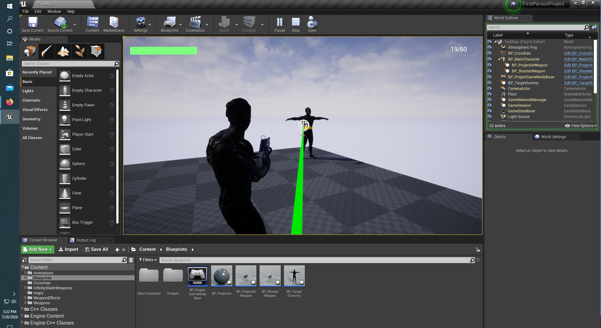
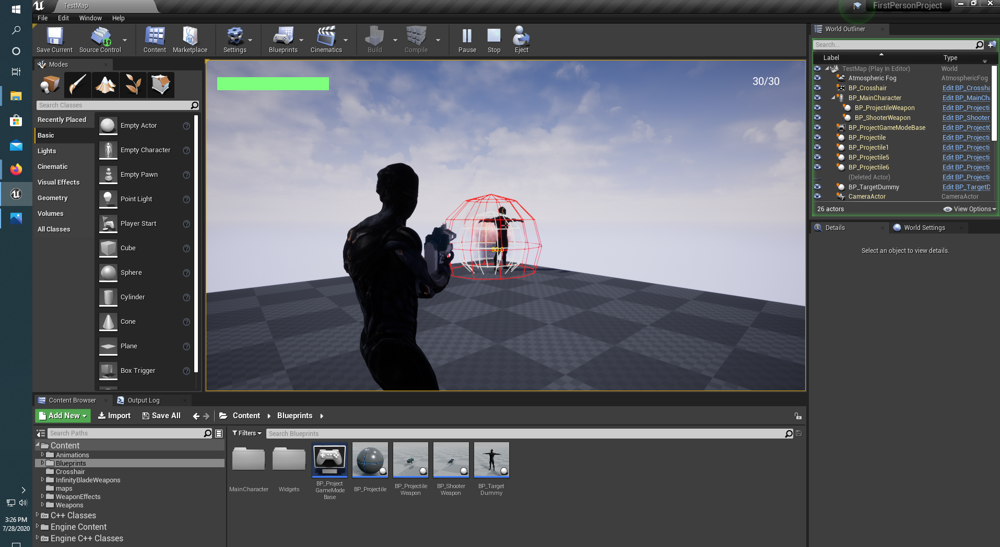

# FirstPersonProject

Developed with Unreal Engine 4. Using a third person character approach, developed a character who has abilities that include horizontal and forward and backward movement,crouching, weapon zoom, ability to fire its weapon, switch to a different weapon, reload weapons, double jump, dash, and take and receive damage. The character is also equipped with a simple HUD to house its health bar, ammo count, and crosshair. An animation blueprint, blendspace and montage were created to bring life to the character. The weapon the character is holding was created from a base weapon class to allow for more weapons to be created and to be modified to specific needs. A line trace from the third person camera is how the weapon is able to apply damage.

